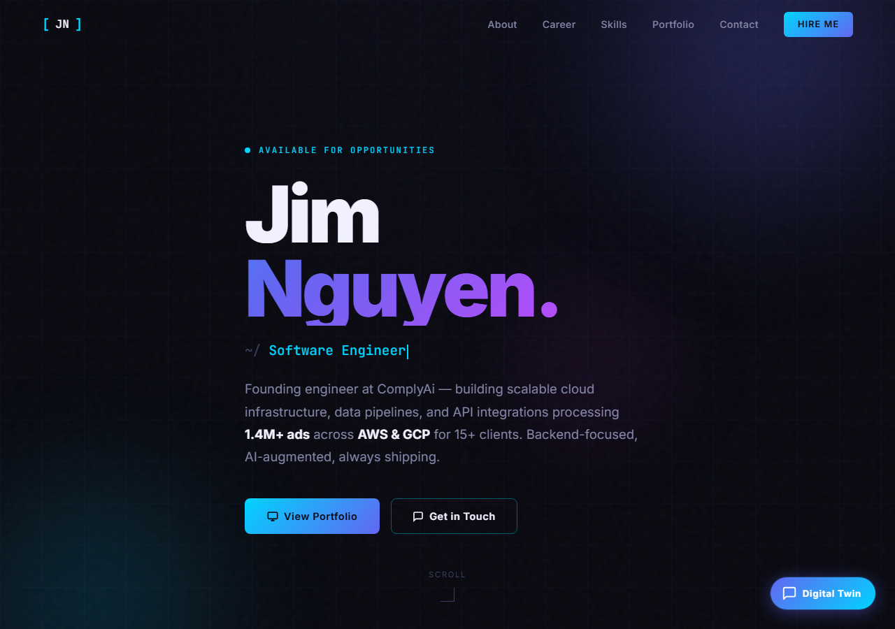

# Jim Nguyen — Portfolio Site

Personal portfolio and AI Digital Twin — built with SolidJS, Vite, and a FastAPI backend.



## Stack

| Layer | Technology |
|-------|-----------|
| Frontend | SolidJS, Vite, vanilla CSS |
| Backend | FastAPI, Python 3.13, uv |
| AI chat | LiteLLM → OpenRouter |
| Testing | Vitest (unit), Playwright (E2E) |

## Features

- Animated hero, career timeline, skills grid, project portfolio
- AI Digital Twin chat widget — asks the backend, which proxies to an LLM
- Smooth scroll-reveal animations with `prefers-reduced-motion` support
- Fully responsive with mobile hamburger nav

## Docker (Quickstart)

```bash
cp .env.example .env     # add your OPENROUTER_API_KEY
make start               # build and run at http://localhost:8000
```

The Docker container builds the SolidJS frontend and serves it from FastAPI alongside the API — single container, single port.

### Makefile

```bash
make start       # build and start on http://localhost:8000
make stop        # stop containers
make logs        # tail container logs
make test        # run backend + frontend unit tests
make test-e2e    # run Playwright E2E (needs backend running)
make clean       # stop and remove containers
```

## Local Development

### Frontend

```bash
npm install
npm run dev          # http://localhost:5173
npm run build        # production build → dist/
npm run test         # vitest unit tests
npm run test:e2e     # playwright E2E (needs backend running)
npm run lint
```

### Backend

```bash
cd backend
uv sync
uv run uvicorn main:app --reload --port 8001
```

**API Documentation** (when backend is running):
- Swagger UI: http://localhost:8001/docs
- ReDoc: http://localhost:8001/redoc

### Environment

Copy `.env.example` to `.env` and fill in the values:

```bash
cp .env.example .env
```

| Variable | Description |
|----------|-------------|
| `VITE_API_URL` | Backend chat endpoint (defaults to `http://localhost:8001/api/chat`) |
| `OPENROUTER_API_KEY` | OpenRouter API key — used by the backend only, never exposed to the browser |

## Architecture

```
Browser
  │
  ├── SolidJS frontend (Vite, vanilla CSS)
  │     ├── Components: Hero, Nav, About, Timeline, Skills, Portfolio, Contact
  │     └── DigitalTwin widget
  │           │  POST /api/chat  (SSE stream)
  │           ▼
  └── FastAPI backend (Python 3.13, uv)
        ├── /api/health        — liveness probe
        ├── /api/chat          — rate-limited (10 req/min), streams LLM tokens
        │     │
        │     ▼  LiteLLM completion(stream=True)
        └── OpenRouter → Free LLM model
```

The frontend and backend are deployed as separate services. `VITE_API_URL` points the SolidJS app at the backend's `/api/chat` endpoint at build time.

## Deployment

1. Build the frontend: `npm run build` — outputs to `dist/`
2. Serve `dist/` as static files (Netlify, Vercel, S3+CloudFront, etc.)
3. Deploy the `backend/` as a Python service (Render, Railway, Fly.io, etc.)
4. Set `VITE_API_URL` at build time to point to the deployed backend
5. Update `allow_origins` in `backend/main.py` to your frontend domain
